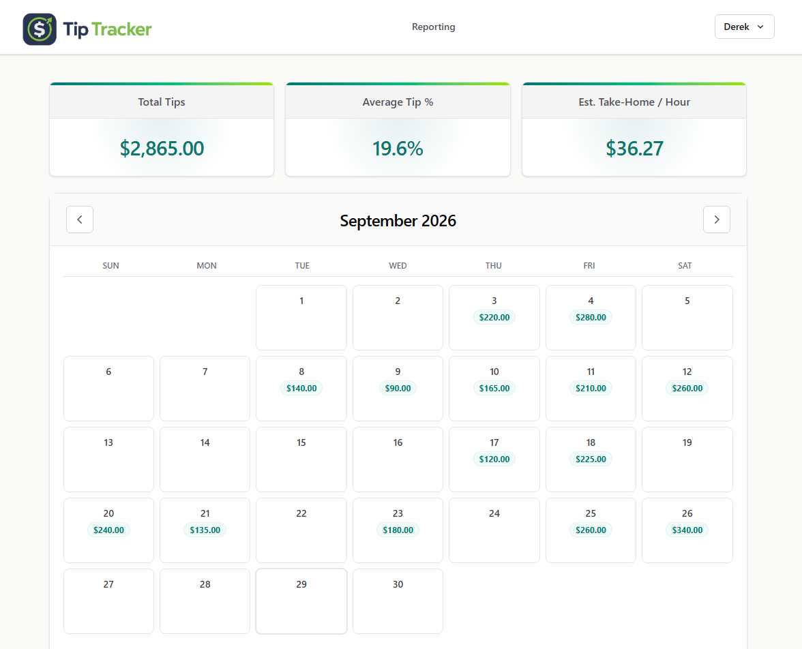

# Tip Tracker

Tip Tracker is a full-stack application for tracking tip income, managing daily earnings, and viewing income reports. Built with React and TypeScript, it features AWS Cognito-backed authentication, persisted daily income entries, a typed Hono API, and AWS infrastructure managed with CDK.

## Live Website
**[https://www.tip-tracker.derek-dev.com](https://www.tip-tracker.derek-dev.com)**



## Tech Stack

- **Frontend:** React, TypeScript, Vite, Tailwind CSS
- **Backend:** Hono, AWS Lambda, API Gateway
- **Infrastructure:** AWS CDK, S3, CloudFront, Route 53
- **Authentication + Database:** Amazon Cognito, DynamoDB
- **CI/CD + Tooling:** GitHub Actions, pnpm, Biome

## Repo Structure

- `ui` - React application built with Vite
- `ui/src/pages` - Application pages and routing
- `ui/src/components` - Reusable UI components
- `ui/src/auth` - Authentication provider and typed API client
- `api` - Serverless Hono API
- `api/src/lambdas` - Lambda entry points and route handlers
- `api/src/contracts` - Shared API types and validators
- `api/src/lib` - Authentication and database utilities
- `infra` - AWS CDK infrastructure
- `.github/workflows/deploy.yml` - Automated deployment workflow

## Local Development

**Prerequisites**

- Node.js `24.12.0`
- pnpm `10.28.2`
- AWS CLI and configured credentials for accessing deployed resources

From the repository root:

- `pnpm install` - Install dependencies
- `pnpm run local-ui` - Start the Vite development server
- `pnpm run local-api` - Start the Hono API
- `pnpm run local` - Start both UI and API

The local API automatically loads `api/.env` when present. Create it from the provided template:

```powershell
Copy-Item api/.env.example api/.env
```

Configure the following environment variables:

- `USER_POOL_ID`
- `USER_POOL_CLIENT_ID`
- `USER_POOL_REGION`
- `DAILY_TIP_ENTRIES_TABLE_NAME`

Cognito configuration can be obtained from the CDK outputs after deploying the API stack.

Local development uses the deployed DynamoDB table and requires AWS credentials with read/write access. Unlike the deployed Lambda, which receives its configuration and IAM permissions through CDK, local development requires these to be configured separately.

Authenticate with AWS SSO before running the local API: `pnpm run sso`

**Local URLs**

- UI: `http://localhost:5173`
- API: `http://localhost:8787`

## Validation

From the repository root:

- `pnpm run typecheck` - Run all package typechecks
- `pnpm run format` - Apply Biome formatting and fixes
- `pnpm run build` - Build all packages

## API

The auth Hono app lives in `api/src/lambdas/auth.ts` and exposes:

- `GET /health`
- `POST /auth/signup`
- `POST /auth/confirm-signup`
- `POST /auth/resend-code`
- `POST /auth/login`
- `POST /auth/refresh`
- `POST /auth/forgot-password`
- `POST /auth/confirm-forgot-password`
- `POST /auth/logout`
- `GET /me`
- `PUT /me`

The daily-entry Hono app lives in `api/src/lambdas/daily-entry.ts` and exposes:

- `GET /daily-entries?startDate=YYYY-MM-DD&endDate=YYYY-MM-DD`
- `GET /daily-entry/{date}`
- `PUT /daily-entry/{date}`
- `DELETE /daily-entry/{date}`

Daily entries are keyed by authenticated Cognito user and date. The frontend never sends `userId`; the API derives it from the signed-in user's HTTP-only Cognito cookies. The request body for `PUT /daily-entry/{date}` contains only `tipsEarned`, `hoursWorked`, and `totalSales`.

The API stores Cognito access, ID, and refresh tokens in HTTP-only cookies. The UI does not store authentication tokens in localStorage.

The UI uses Hono's typed client from `hono/client` for auth calls and shared API response/request types from the `api` workspace package. Authenticated API requests send cookies with each request and retry once through `/auth/refresh` when an authenticated request returns `401`.

The `/app` and `/reporting` UI routes are protected by the auth provider. If `/me` cannot resolve a signed-in user, the user is routed back to `/`.

Authenticated pages use a shared app layout with a navbar, footer, and Cognito-backed Profile and Preferences modals.

Authentication supports self-signup with user-defined passwords and email verification through Amazon Cognito.

## Infrastructure

The CDK app lives in `infra` and defines two stacks:

- `tip-tracker-ui`
- `tip-tracker-api`

CDK context in `infra/cdk.json` controls the hosted domain:

- `rootDomain` - Route 53 hosted zone domain
- `hostedZoneId` - Route 53 hosted zone ID
- `siteSubdomain` - Subdomain deployed by this project; leave empty to deploy at the root domain

The UI stack deploys the built UI from `ui/dist` to `tip-tracker.derek-dev.com` by default.

The UI stack creates:

- Private S3 bucket for static site assets
- CloudFront distribution with Origin Access Control
- CloudFront proxy behaviors for `/auth/*`, `/daily-entry/*`, `/daily-entries`, `/me`, and `/health` so the deployed UI calls the API through the same site origin
- CloudFront Function SPA routing for extensionless UI paths like `/verify`
- ACM certificate for the primary domain and `www` domain
- Route 53 A and AAAA alias records for both domains
- Bucket deployment with CloudFront invalidation

The API stack creates:

- Cognito user pool
- Cognito user pool client
- HTTP API Gateway
- `tip-tracker-auth` Lambda backed by the Hono API
- `tip-tracker-daily-entry` Lambda backed by the daily-entry Hono API
- DynamoDB table for daily tip entries with `userId` as the partition key and `date` as the sort key
- API Gateway route integrations for auth and daily-entry routes

## Deployment

### Automated (GitHub Actions)

The workflow runs on pushes to `main` and supports manual dispatches.

- Installs Node.js and pnpm
- Installs dependencies using `pnpm install --frozen-lockfile`
- Assumes the AWS IAM role configured in `AWS_DEPLOY_ROLE_ARN`
- Executes `pnpm run github-action-deploy`
- Deploys to AWS `us-east-1`

### Manual (AWS SSO)

For local deployments, authenticate with AWS SSO and deploy using:

- `pnpm run sso` - Authenticate with AWS SSO
- `pnpm run diff` - Preview infrastructure changes
- `pnpm run synth` - Synthesize the CDK stacks
- `pnpm run deploy` - Deploy the CDK stacks
